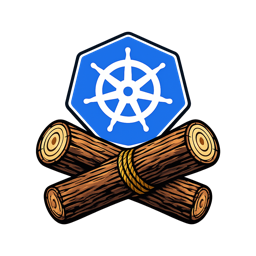

# kubernetes-event-logger



[](https://github.com/patbos/kubernetes-event-logger/actions/workflows/ci.yml)

A lightweight Kubernetes event logger that watches cluster events and writes new events as JSON to stdout.

## Overview

`kubernetes-event-logger` watches `core/v1` `Event` resources across the cluster and emits them in a log-friendly JSON envelope. It ignores historical events that already existed before the active leader began processing, supports repeated exclusion rules, and exposes Prometheus metrics plus HTTP health endpoints on port `8080`.

The binary is intended to run either:

- in-cluster as a Deployment, typically with `replicaCount > 1` and leader election enabled
- locally with a kubeconfig for development or troubleshooting

## Features

- Cluster-wide Kubernetes event watching
- JSON output to stdout for log shipping pipelines
- Historical event suppression on startup and leader transitions
- Repeatable event exclusion filters
- In-cluster and kubeconfig-based authentication
- Leader election for active/standby deployments
- Prometheus metrics at `/metrics`
- HTTP health endpoints at `/healthz` and `/readyz`
- Distroless container image
- Helm chart with RBAC, probes, PDB, Service, optional ServiceMonitor, and optional NetworkPolicy

## Requirements

- Kubernetes `1.25+` (for stable PodDisruptionBudget API)
- Go `1.26.2+` to build from source
- Access to a Kubernetes cluster
- RBAC permission to read `events`
- RBAC permission to manage a `Lease` in the deployment namespace for leader election
- If you use Pod Security Admission, label the target namespace separately; this chart does not enforce PSA by applying pod labels

## Installation

### Helm

```bash
helm install kubernetes-event-logger oci://ghcr.io/patbos/kubernetes-event-logger --version <version>
```

Override values inline:

```bash
helm install kubernetes-event-logger oci://ghcr.io/patbos/kubernetes-event-logger \
  --version <version> \
  --set replicaCount=2 \
  --set image.tag=v0.2.2 \
  --set image.digest=sha256:<digest> \
  --set 'excludeFilters[0].kind=Node' \
  --set 'excludeFilters[0].type=Normal' \
  --set 'excludeFilters[1].namespace=kube-system' \
  --set 'excludeFilters[1].reason=Scheduled'
```

Or use a values file:

```yaml
replicaCount: 2

image:
  tag: v0.2.2
  digest: sha256:<digest>

excludeFilters:
  - kind: Node
    type: Normal
  - namespace: kube-system
    reason: Scheduled

serviceMonitor:
  enabled: true

resources:
  requests:
    cpu: 50m
    memory: 64Mi
  limits:
    cpu: 500m
    memory: 512Mi
```

```bash
helm install kubernetes-event-logger oci://ghcr.io/patbos/kubernetes-event-logger \
  --version <version> \
  -f my-values.yaml
```

### Local Binary

```bash
go build -o kubernetes-event-logger .
./kubernetes-event-logger
```

Use a specific kubeconfig:

```bash
./kubernetes-event-logger -kubeconfig=/path/to/kubeconfig
```

### Docker

```bash
docker build -t kubernetes-event-logger .
docker run -v ~/.kube/config:/config:ro kubernetes-event-logger -kubeconfig=/config
```

## Verifying Images

Release images are signed with `cosign` in the GitHub Actions release workflow and should be verified by digest.

Resolve a digest for a published tag:

```bash
docker buildx imagetools inspect ghcr.io/patbos/kubernetes-event-logger:v0.2.2
```

Verify the signature for a specific digest:

```bash
cosign verify \
  --certificate-identity-regexp 'https://github.com/patbos/kubernetes-event-logger/.github/workflows/release.yml@refs/tags/v.*' \
  --certificate-oidc-issuer https://token.actions.githubusercontent.com \
  ghcr.io/patbos/kubernetes-event-logger@sha256:<digest>
```

Use the verified digest in Helm:

```bash
helm install kubernetes-event-logger oci://ghcr.io/patbos/kubernetes-event-logger \
  --version 0.2.2 \
  --set image.tag=v0.2.2 \
  --set image.digest=sha256:<digest>
```

## Configuration

### Authentication

The binary first tries the supplied kubeconfig path. If that fails, it falls back to in-cluster configuration.

- Default `-kubeconfig`: `~/.kube/config` when the file exists; otherwise falls back to in-cluster config
- In Kubernetes, set `POD_NAMESPACE` from `metadata.namespace` so leader election uses the correct namespace

### Command-line Flags

| Flag | Description | Default |
|---|---|---|
| `-kubeconfig` | Path to kubeconfig file; falls back to in-cluster config when not set | `~/.kube/config` if it exists, otherwise empty |
| `-lease-name` | Name of the leader election Lease resource | `kubernetes-event-logger` |
| `-lease-duration` | Duration a leader lease remains valid | `15s` |
| `-renew-deadline` | Time the leader has to renew the lease | `10s` |
| `-retry-period` | Retry interval for acquiring or renewing the lease | `2s` |
| `-enable-detailed-metrics` | Enable high-cardinality metrics (namespace, reason, kind) | `false` |
| `-exclude-filter` | Exclude events matching all clauses in one rule; repeatable | none |

`-exclude-filter` syntax:

```text
field=value[,field=value]
```

Supported filter fields:

- `namespace`
- `kind`
- `name`
- `reason`
- `type`
- `reporting-component`
- `reporting-controller`
- `source-component`

Example:

```bash
./kubernetes-event-logger \
  -exclude-filter=kind=Node,type=Normal \
  -exclude-filter=namespace=kube-system,reason=Scheduled
```

Each filter rule is AND-matched internally, and the full rule set is OR-matched across rules.

### Environment Variables

| Variable | Description | Default |
|---|---|---|
| `POD_NAMESPACE` | Namespace used for the leader election `Lease` object | `default` |

### Helm Values

Common chart values:

| Value | Description | Default |
|---|---|---|
| `replicaCount` | Number of pods to run; leader election ensures only one actively processes events | `2` |
| `image.repository` | Container image repository | `ghcr.io/patbos/kubernetes-event-logger` |
| `image.tag` | Image tag; falls back to chart `appVersion` | `""` |
| `image.digest` | Immutable image digest; when set, the chart renders `repository[:tag]@digest` | `""` |
| `image.pullPolicy` | Image pull policy | `IfNotPresent` |
| `serviceAccount.create` | Create a dedicated ServiceAccount for this release | `true` |
| `serviceAccount.name` | ServiceAccount name override; required when `serviceAccount.create=false` | `""` |
| `excludeFilters` | List of event exclusion rules | `[]` |
| `enableDetailedMetrics` | Enable high-cardinality Prometheus metrics | `false` |
| `leaderElection.leaseDuration` | Leader lease duration | `15s` |
| `leaderElection.renewDeadline` | Lease renew deadline | `10s` |
| `leaderElection.retryPeriod` | Lease retry interval | `2s` |
| `serviceMonitor.enabled` | Create a Prometheus Operator `ServiceMonitor` | `false` |
| `networkPolicy.enabled` | Create a `NetworkPolicy` for metrics ingress and DNS/API egress | `false` |
| `podDisruptionBudget.enabled` | Create a PodDisruptionBudget | `true` |
| `podDisruptionBudget.minAvailable` | Minimum available pods during voluntary disruptions | `1` |
| `resources` | Pod resource requests and limits | see [`chart/values.yaml`](chart/values.yaml) |
| `affinity` | Custom affinity rules; `null` activates built-in pod anti-affinity | `null` |
| `topologySpreadConstraints` | Topology spread constraints for pod distribution | `[]` |
| `tolerations` | Pod tolerations | `[]` |
| `nodeSelector` | Node selector for pod scheduling | `{}` |
| `priorityClassName` | Priority class for pods | `""` |
| `terminationGracePeriodSeconds` | Grace period for graceful shutdown | `30` |
| `strategy` | Deployment update strategy | RollingUpdate (maxSurge=0, maxUnavailable=1) |

See [`chart/values.yaml`](chart/values.yaml) for the full chart surface, including probes, port configuration, security context, and ServiceMonitor labels.

## High Availability

Leader election is always used. Only the current leader processes and logs events; standby replicas wait for failover.

The leader election `Lease`:

- is named `kubernetes-event-logger`
- lives in the namespace from `POD_NAMESPACE`
- uses the pod hostname as the holder identity

During failover or rollout, some events can be logged twice. Downstream consumers should treat the stream as at-least-once.

## RBAC

The application needs:

- a cluster-scoped permission set to `get`, `list`, and `watch` `events`
- a namespaced permission set to `get` and `update` the leader-election `Lease` in `coordination.k8s.io`

The bundled Helm chart creates the required ServiceAccount, ClusterRole, ClusterRoleBinding, Role, RoleBinding, and pre-created `Lease` resources.
If you set `serviceAccount.create=false`, you must also set `serviceAccount.name` so the chart binds permissions to an explicit existing ServiceAccount.

## Pod Security

The chart is configured to be compatible with the Kubernetes restricted profile by running as non-root, dropping Linux capabilities, using `RuntimeDefault` seccomp, and setting a read-only root filesystem.

Pod Security Admission enforcement is namespace-scoped. If you want Kubernetes to enforce the restricted policy, label the namespace that will run this workload, for example:

```bash
kubectl label namespace <namespace> \
  pod-security.kubernetes.io/enforce=restricted \
  pod-security.kubernetes.io/audit=restricted \
  pod-security.kubernetes.io/warn=restricted
```

## HTTP Endpoints

The process listens on port `8080`.

| Path | Purpose |
|---|---|
| `/metrics` | Prometheus metrics |
| `/healthz` | JSON health response used by the liveness probe |
| `/readyz` | JSON health response used by the readiness probe |

Example `/healthz` response:

```json
{
  "status": "healthy",
  "leader": true,
  "cache_synced": true,
  "uptime_seconds": 42.7,
  "version": "dev"
}
```

Both endpoints currently return the same JSON payload and status code. They return HTTP `503` until informer cache sync completes. Non-leader replicas still report healthy once synced because they are ready to take over.

## Metrics

Prometheus metrics currently exposed at `/metrics`:

- `kubernetes_event_logger_events_total`
- `kubernetes_event_logger_events_filtered_total`
- `kubernetes_event_logger_events_failed_total`
- `kubernetes_event_logger_event_processing_duration_seconds`
- `kubernetes_event_logger_last_event_processed_timestamp_seconds`
- `kubernetes_event_logger_leader`
- `kubernetes_event_logger_leader_elections_total`
- `kubernetes_event_logger_informer_cache_sync_duration_seconds`
- `kubernetes_event_logger_events_by_namespace_total` (optional, via `-enable-detailed-metrics`)
- `kubernetes_event_logger_events_by_reason_total` (optional, via `-enable-detailed-metrics`)
- `kubernetes_event_logger_events_by_object_kind_total` (optional, via `-enable-detailed-metrics`)

## Output Format

Each log line is a JSON object with:

- `time`: event timestamp chosen from `eventTime`, `series.lastObservedTime`, `lastTimestamp`, or `firstTimestamp` (in that order)
- `level`: derived from event type (`Warning` -> `warn`, `Normal` -> `info`, other values -> `debug`)
- `event`: the original Kubernetes event object

Example:

```json
{
  "time": "2025-11-23T15:00:00Z",
  "level": "info",
  "event": {
    "metadata": {
      "name": "pod-example.17a1b2c3d4e5f6",
      "namespace": "default",
      "creationTimestamp": "2025-11-23T15:00:00Z"
    },
    "involvedObject": {
      "kind": "Pod",
      "namespace": "default",
      "name": "example-pod"
    },
    "reason": "Started",
    "message": "Started container app",
    "type": "Normal",
    "firstTimestamp": "2025-11-23T15:00:00Z",
    "lastTimestamp": "2025-11-23T15:00:00Z"
  }
}
```

## Development

### Setup

Install the following tools before building, testing, or linting:

**Go** (1.26.2+)

Follow the [official installation guide](https://go.dev/doc/install).

**golangci-lint** (v2)

```bash
go install github.com/golangci/golangci-lint/v2/cmd/golangci-lint@v2.11.4
```

**Helm**

Follow the [official installation guide](https://helm.sh/docs/intro/install/).

**helm-unittest plugin**

```bash
helm plugin install https://github.com/helm-unittest/helm-unittest
```

**hadolint** (Dockerfile linter)

```bash
# macOS
brew install hadolint

# Linux
wget -O /usr/local/bin/hadolint https://github.com/hadolint/hadolint/releases/latest/download/hadolint-Linux-x86_64
chmod +x /usr/local/bin/hadolint
```

**Docker** — required for container image builds only. Follow the [official installation guide](https://docs.docker.com/get-docker/).

### Running all validations

```bash
make all
```

This runs formatting check, lint, Go tests, Helm lint, and Helm unit tests — matching what CI runs on every push.

Individual targets:

```bash
make fmt-check     # check Go formatting
make lint          # run golangci-lint
make test          # run Go unit tests
make helm-lint     # lint the Helm chart
make helm-test     # run Helm chart unit tests
make dockerfile-lint  # lint the Dockerfile with hadolint
make validate      # all of the above including dockerfile-lint
make build         # build the binary
make docker-build  # build the container image
make fmt           # format Go files in place
make clean         # remove the built binary
```

### Build

```bash
make build
# or: go build -o kubernetes-event-logger .
```

### Test

```bash
make test
# or: go test ./...
```

Current automated tests cover event filter parsing and matching, health endpoint behavior, timestamp selection, and related helper logic in `filters_test.go` and `main_test.go`.

### Lint

```bash
make lint
# or: golangci-lint run ./...
```

Static analysis and security linting checks for:
- Unchecked error returns
- Unused variables and imports
- Security anti-patterns (gosec)
- Code simplifications and inefficiencies
- Context and error handling issues

### Helm Validation

```bash
make helm-lint helm-test
# or: helm lint chart && helm unittest chart
```

Helm unit tests live in `chart/tests/*_test.yaml`.

### Container Build

```bash
make docker-build
# or: docker build -t kubernetes-event-logger .
```

The Docker image uses a multi-stage build and a distroless runtime image.

## Publishing

GitHub Actions publishes multi-architecture container images to GitHub Container Registry (`ghcr.io`) on pushes to `main`, version tags matching `v*`, and manual workflow runs.
